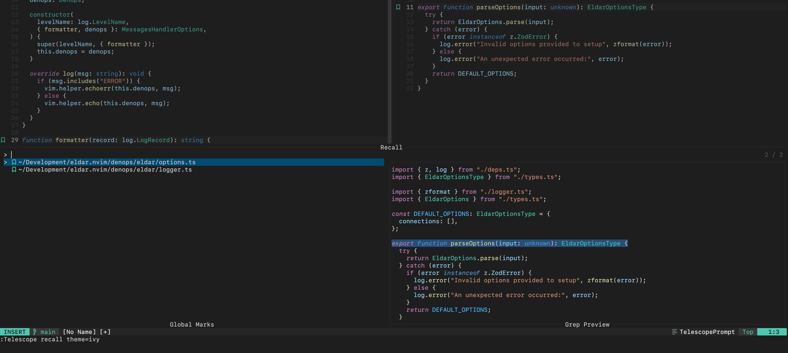

# 🔖 Recall

[](https://github.com/fnune/recall.nvim/actions/workflows/test.yml)

Recall refines the use of [Neovim marks][marks] by focusing on global marks,
streamlining their usage and enhancing their visibility and navigability.

- Emphasizes global marks for cross-file functionality.
- Utilizes a consistent visual indicator in the sign column: a single sign
  character for all marks.
- Facilitates global mark navigation with `:RecallNext` and `:RecallPrevious`,
  circumventing the need for direct letter references.
- Simplifies mark setting and removal with `:RecallToggle`, abstracting away
  the burden of choosing and remembering specific letters.

Recall attempts to eliminate the cognitive overhead associated with mark
management, enabling you to focus on your workflow, not on mark administration.
Its enhancements are strictly additive to Neovim's existing mark features,
which you can continue to use to their fullest potential.


_Recall showing two global marks and available commands._


_Telescope integration using `:Telescope recall theme=ivy`._

[marks]: https://neovim.io/doc/user/motion.html#mark-motions

<!-- vim-markdown-toc GFM -->

* [Planned features](#planned-features)
* [Installation](#installation)
  * [Telescope integration](#telescope-integration)
  * [The `wshada` option](#the-wshada-option)
  * [Usage commands](#usage-commands)
    * [Navigation logic](#navigation-logic)
* [Inspirations](#inspirations)
* [Contributions](#contributions)
* [Licensing](#licensing)

<!-- vim-markdown-toc -->

## Planned features

- [x] Basic global mark management with `:Recall{Toggle,Mark,Unmark}` and
      `:RecallClear`
- [x] Basic global mark navigation with `:Recall{Next,Previous}`
- [x] Sign column with a customizable character
- [x] Support for Neovim 0.10.x and also 0.9.x and lower
- [x] Telescope integration beyond the built-in `:Telescope marks` that allows
      mark deletion and displaying only global marks
- [ ] Improved stability by adding CI and testing using
      [plenary][plenary-tests]

[plenary-tests]: https://github.com/nvim-lua/plenary.nvim/blob/master/TESTS_README.md

## Installation

Recall requires no configuration:

```lua
require("recall").setup({})
```

But you can customize it. Here are the default options:

```lua
require("recall").setup({
  sign = "",
  sign_highlight = "@comment.note",

  telescope = {
    autoload = true,
    mappings = {
      unmark_selected_entry = {
        normal = "dd",
        insert = "<C-m>",
      },
    },
  },

  wshada = vim.fn.has("nvim-0.10") == 0,
})
```

Recall ships with no mappings by default. Add your own, using the Lua API or
the user commands that ship with it.

<details>
<summary>Example mappings</summary>

```lua
-- Using commands:
vim.keymap.set("n", "<leader>mm", ":RecallToggle<CR>", { noremap = true, silent = true })
vim.keymap.set("n", "<leader>mn", ":RecallNext<CR>", { noremap = true, silent = true })
vim.keymap.set("n", "<leader>mp", ":RecallPrevious<CR>", { noremap = true, silent = true })
vim.keymap.set("n", "<leader>mc", ":RecallClear<CR>", { noremap = true, silent = true })
vim.keymap.set("n", "<leader>ml", ":Telescope recall<CR>", { noremap = true, silent = true })

-- Using the Lua API:
local recall = require("recall")

vim.keymap.set("n", "<leader>mm", recall.toggle, { noremap = true, silent = true })
vim.keymap.set("n", "<leader>mn", recall.goto_next, { noremap = true, silent = true })
vim.keymap.set("n", "<leader>mp", recall.goto_prev, { noremap = true, silent = true })
vim.keymap.set("n", "<leader>mc", recall.clear, { noremap = true, silent = true })
vim.keymap.set("n", "<leader>ml", ":Telescope recall<CR>", { noremap = true, silent = true })
```

</details>

<details>
<summary>Example <code>lazy.nvim</code> plugin spec</summary>

```lua
{
  "fnune/recall.nvim",
  config = function()
    local recall = require("recall")

    recall.setup({})

    vim.keymap.set("n", "<leader>mm", recall.toggle, { noremap = true, silent = true })
    vim.keymap.set("n", "<leader>mn", recall.goto_next, { noremap = true, silent = true })
    vim.keymap.set("n", "<leader>mp", recall.goto_prev, { noremap = true, silent = true })
    vim.keymap.set("n", "<leader>mc", recall.clear, { noremap = true, silent = true })
    vim.keymap.set("n", "<leader>ml", ":Telescope recall<CR>", { noremap = true, silent = true })
  end
}
```

</details>

### Telescope integration

If you have Telescope installed, Recall will loads its extension so that you
can use `:Telescope recall`. Within the Recall Telescope picker, you can use
`dd` in normal mode or `<C-m>` in insert mode to delete the selected global
mark.

To open the Recall Telescope picker, use `:Telecope recall`. You can pass a
`theme` option with a Telescope built-in theme such as `:Telescope recall
theme=ivy`.

To change or unset the default mappings, use:

```lua
require("recall").setup({
  telescope = {
    mappings = {
      unmark_selected_entry = {
        normal = "d",
        insert = nil,
      },
    },
  },
})
```

If you prefer loading the Recall Telescope extension manually, do this:

```lua
require("recall").setup({
  telescope = {
    autoload = false,
  },
})

require("telescope").load_extension("recall")
```

### The `wshada` option

It is only necessary to set `wshada` to `true` on Neovim versions older than
0.10. Recall's default configuration does this for you. When enabled, this
option will call `:wshada!` after every change to global marks in order to
guarantee their persistence in the [`shada` file][shada-docs].

> ⚠️ Writing to the `shada` file with `:wshada!` may overwrite data such as
> location list entries from Neovim instances other than your current one. See
> `:h wshada` for more details.

To learn more about this, see the related [issue][shada-issue] and [pull
request][shada-pr] including a fix that ships with Neovim 0.10.

[shada-docs]: https://neovim.io/doc/user/starting.html#shada
[shada-issue]: https://github.com/neovim/neovim/issues/4295
[shada-pr]: https://github.com/neovim/neovim/pull/24936

### Usage commands

- `:RecallMark` - Mark the current line.
- `:RecallUnmark` - Unmark the current line.
- `:RecallToggle` - Mark or unmark the current line.
- `:RecallNext`/`:RecallPrevious` - Navigate through marks linearly, respecting
  the sequence A-Z and wrapping accordingly.
- `:RecallClear` - Clear all global marks.

#### Navigation logic

- Recall identifies the 'latest' mark by picking the current cursor position if
  it's a global mark, or using the [jump list][jumplist] to find the
  latest-jumped-to mark.
- To navigate, Recall advances sequentially through the letters with inherent
  looping from `Z` to `A` and vice versa.

[jumplist]: https://neovim.io/doc/user/motion.html#jump-motions

## Inspirations

I've used most of these plug-ins at some point, and they have helped me
materialize the ideas for Recall.

- [otavioschwanck/arrow.nvim](https://github.com/otavioschwanck/arrow.nvim)
- [ThePrimeagen/harpoon](https://github.com/ThePrimeagen/harpoon)
- [chentoast/marks.nvim](https://github.com/chentoast/marks.nvim)
- [jeetsukumaran/vim-markology](https://github.com/jeetsukumaran/vim-markology)
- [kshenoy/vim-signature](https://github.com/kshenoy/vim-signature)

## Contributions

You're welcome to contribute pull requests and well-crafted issues to Recall!

## Licensing

[The MIT license](./LICENSE.md).
